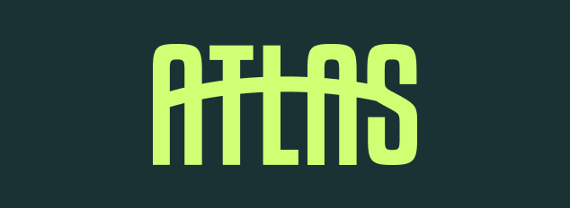
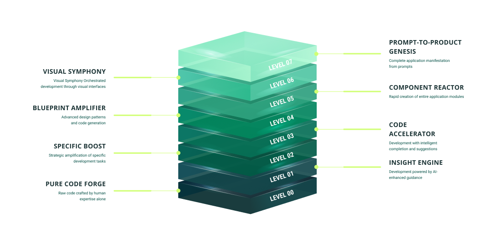

# ATLAS Framework 🚀
### AI Tiered Levels for Agile Software

<div align="center">
  
  <br/><br/>
  <p><em>A structured approach for determining the optimal level of AI assistance for software development projects</em></p>
  <p><a href="https://atlas-framework.com/levels#level7" target="_new"></a></p>
</div>

## 📋 Overview

The ATLAS Framework defines 8 levels of AI integration in software development, ranging from fully manual coding to complete application generation from natural language prompts. By evaluating specific project characteristics against defined criteria, teams can select the most appropriate development approach along the spectrum from traditional coding to AI-driven development.

<div align="center">
  
</div>

## 🏗️ Framework Components

- **AI Assistance Levels** - Detailed descriptions of 8 levels with selection criteria
- **Decision Matrix** - Factors to consider when selecting the appropriate level
- **Implementation Strategy** - A phased approach to adopting AI assistance
- **Productivity vs. Control Tradeoffs** - Understanding the balance between speed and oversight
- **Migration Considerations** - Guidelines for moving between different levels

## 🔍 The 8 Levels of AI Integration

| Level | Name | Description |
|-------|------|-------------|
| **0** | **Pure Code Forge** | Raw code crafted by human expertise alone |
| **1** | **Insight Engine** | Development powered by AI-enhanced guidance |
| **2** | **Specific Boost** | Strategic amplification of specific development tasks |
| **3** | **Code Accelerator** | Development with intelligent completion and suggestions |
| **4** | **Blueprint Amplifier** | Advanced design patterns and code generation |
| **5** | **Component Reactor** | Rapid creation of entire application modules |
| **6** | **Visual Symphony** | Orchestrated development through visual interfaces |
| **7** | **Prompt-to-Product Genesis** | Complete application manifestation from prompts |

## 🚀 Why Use ATLAS?

The optimal level of AI assistance varies by project, team, and organizational context. This framework provides a structured approach to making this decision, helping teams:

- Make informed decisions about AI integration
- Balance productivity gains with control requirements
- Adapt their approach as project needs evolve
- Implement AI assistance in a strategic, phased manner

## 🖥️ About This Website

This documentation site is built with:

- [Next.js](https://nextjs.org/) - React framework for production
- [TailwindCSS](https://tailwindcss.com/) - Utility-first CSS framework
- [shadcn/ui](https://ui.shadcn.com/) - Re-usable components built with Radix UI and Tailwind
- [next-themes](https://github.com/pacocoursey/next-themes) - Theme management

## 🛠️ Local Development

```bash
# Clone the repository
git clone https://github.com/yourusername/atlas-framework.git

# Navigate to the directory
cd atlas-framework

# Install dependencies
npm install --legacy-peer-deps

# Start the development server
npm run dev
```

## 📱 Deployment

This site is deployed as a static site on GitHub Pages. To deploy your own version:

1. Fork this repository
2. Enable GitHub Pages in your repository settings
3. Push changes to the master branch to trigger automatic deployment

## 📄 License

This project is licensed under the MIT License - see the LICENSE file for details.

## 🤝 Contributing

Contributions are welcome! Please feel free to submit a Pull Request.

---

<div align="center">
  <p>Developed with ❤️ by <a href="https://github.com/yourusername">Your Name</a></p>
  <p>© 2025 ATLAS Framework</p>
</div>